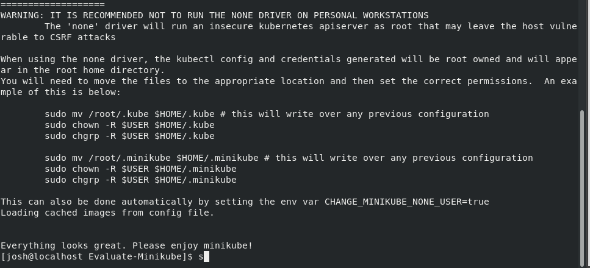

# Evaluate Minikube

### Pros
1. Easy to setup (if not using Fedora 29 with Secure Boot enabled)
    - VirtualBox will not work with Secure Boot enabled <-- **production concern**
2. Large userbase and is well maintained
3. Supportes Windows, Linux and MacOS
4. Supports [Helm](https://helm.sh/)
5. Can run without a VM if Docker is installed on Linux.
    - However...
    

### Cons
1. Nat and host only networking and it does not support bridged networking.
    - [However, port forwarding may be possible.](https://cwienczek.com/2017/09/reaching-minikube-from-other-devices/)
    - 
    - 
2. Requires access to public internet to download dependencies
3. Conflicts with out Mac Watcher dev environment
    - breakes kubectl
4. Not considered production ready by most
5. Can't port forward reserved ports 0 - 1024 even with sudo
    - Must use non reserved ports > 1024
    - 
6. It is a VM on non Linux OSes, so a HyperVisor is required to run it. 
    - Problematic if you are trying to run it on a VM IaaS platform such as EC2 due to nested virtualization

### Upgradeability
- Persistant volumes are mapped to directories inside the Minikube VM.
    - It appears that is possible to mount a directory on the host machine to the
        - However, this may be a problem.
        - 
        - However, it could be mitigated using `&`
        - **Command:** `minikube mount ~/temp/minikube/:/host`

### Relation to Boot2Docker / Docker Machine
- These projects are not related. However, the process of connecting to an external machine running a service is shared. Docker Machine is a CLI tool that allows administration of a remote machine or VM running Docker Engine. Minikube is a CLI tool that allows you to manage a Kubernetes node running in a VM. Docker Machine can used to [provision cloud servers on various cloud platforms](https://docs.docker.com/machine/get-started-cloud/), however doing so would limit you to Docker Swarm cluster cluster management.

### Overall
- After using it for a while, it just feels like a dev tool instead of something you would use in production. Production concerns do not appear to have been considered in this product.
